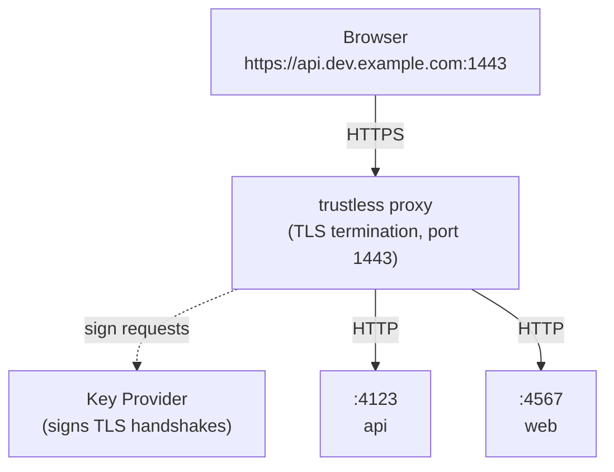

# trustless

HTTPS on registrable domains for local development -- without touching your system trust store.

```
trustless exec api rails server
# -> https://api.developers.example.com:1443
```

## Why

Tools like [Portless](https://github.com/vercel-labs/portless) solve the port-number problem by giving each dev server a stable `.localhost` URL. But `.localhost` is not a registrable domain, so:

- **Same-site cookies don't work** -- `a.localhost` and `b.localhost` are independent sites, not subdomains of a common registrable domain, so `SameSite` cookies can't be shared between services
- **Secure context requires HTTPS on real domains** -- browsers grant secure context to plain `localhost`, but once you use a registrable domain you need a real TLS certificate
- **Self-signed certs need trust store changes** -- installing a local CA means modifying system or browser trust stores on every developer's machine

Trustless fixes this by sharing a publicly trusted certificate through a key provider you deploy once, then every developer on the team gets HTTPS on registrable domains with zero local trust store changes.

> [!CAUTION]
> **You are sharing a private key.** Anyone with access to the key provider can sign TLS handshakes -- which means they can impersonate the domain. Signing is the most important operation of an asymmetric key, and sharing it is inherently risky.
>
> This architecture reduces abuse risk compared to distributing raw key files: access to signing can be revoked instantly by removing provider access, and the key itself is never exported. But while someone has access, they can fully impersonate the domain.
>
> To limit the blast radius: **use a dedicated domain exclusively for local development** (e.g. `*.lo.mycompany-dev.com`). Never reuse certificates or domains that serve real traffic.

## How It Works



1. **Key provider** -- You deploy a provider (e.g. AWS Lambda + S3) that holds a wildcard certificate for your dev domain. The provider signs TLS handshake data on request but never exports the private key.
2. **Proxy** -- `trustless proxy` runs locally, terminates TLS using the provider for signing, and forwards plain HTTP to your app on loopback.
3. **Exec** -- `trustless exec <name> <command>` assigns an ephemeral port, registers a route with the proxy, and starts your app with `PORT` and `HOST` set.

## Quick Start

### 1. Deploy a key provider

See [AWS Lambda Provider](docs/lambda-provider.md) for a ready-made provider, or [Writing a Key Provider](docs/writing-key-provider.md) to build your own.

### 2. Configure trustless

```bash
trustless setup -- trustless-provider-lambda --function-name my-key-provider
```

### 3. Run your app

```bash
trustless exec api rails server
# -> https://api.dev.example.com:1443

trustless exec web next dev
# -> https://web.dev.example.com:1443
```

The proxy auto-starts when you run `trustless exec`. Start it explicitly with `trustless proxy start` if you prefer.

## DNS Setup

Configure your key provider to host a certificate for a dedicated dev domain (e.g. `*.dev.example.com`) and point its DNS records to `127.0.0.1` and `::1`.

Keep this domain isolated from staging and production. Anyone with access to the key provider can sign TLS handshakes for its domains -- you don't want that overlapping with real infrastructure.

## Profiles

Use multiple profiles when you have more than one key provider:

```bash
trustless setup --profile=another -- ...
trustless exec --profile=another api rails server
```

## Commands

```bash
trustless setup [--profile=NAME] -- <provider-command...>   # Save a provider to a profile
trustless exec <name> [--profile=NAME] <command...>         # Run app behind the HTTPS proxy
trustless proxy start                                       # Start the proxy
trustless proxy stop                                        # Stop a running proxy
trustless proxy reload                                      # Reload provider configuration
trustless route add <hostname> <backend>                    # Register a static route
trustless route remove <hostname>                           # Remove a route
trustless status                                            # Show proxy status and routes
trustless test-provider [--profile=NAME]                    # Verify a provider works
```

## Prior Art

Heavily inspired by [vercel-labs/portless](https://github.com/vercel-labs/portless). Portless gives each dev server a stable `.localhost` URL over HTTP. Trustless extends the idea to registrable domains over HTTPS, for cases where you need same-site cookies or secure context on real domains.

## State Directory

`$XDG_RUNTIME_DIR/trustless` or `~/.local/state/trustless`
