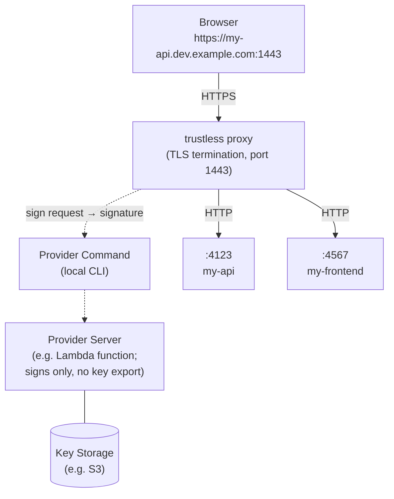

# trustless

HTTPS on registrable domains for local development -- without touching your system trust store.

```
trustless run rails server
# -> https://my-project.dev.example.com:1443
```

Trustless infers a subdomain from your project (directory name, package.json, or `.trustless.json`), allocates an ephemeral port, and starts your app behind a local HTTPS proxy -- all with a single command.

## Why

Tools like [Portless](https://github.com/vercel-labs/portless) solve the port-number problem by giving each dev server a stable `.localhost` URL. But `.localhost` is not a registrable domain, so:

- **Same-site cookies don't work.** `a.localhost` and `b.localhost` are independent sites, not subdomains of a common registrable domain, so `SameSite` cookies can't be shared between services
- **Secure context requires HTTPS with trusted certificates.** Browsers grant secure context to plain `localhost`, but once you use a registrable domain, you need a real TLS certificate
- **Self-signed certs need trust store changes.** Installing a local CA means modifying system or browser trust stores on every developer's machine and poses security risks if not handled carefully.

Trustless fixes this by sharing a publicly trusted certificate through a key provider you deploy once, then every developer on the team gets HTTPS on registrable domains with zero local trust store changes.

__It's noteworthy that sharing a private key is risky!__ We tolerate by minimizing its risk. By having a key provider in between a locally running HTTPS proxy and actual key materials, we can instantly revoke access when needed.

## How It Works



1. **Key provider** -- You deploy a provider (e.g. AWS Lambda + S3) that holds a wildcard certificate for your dev domain. The provider signs TLS handshake data on request but never exports the private key.
2. **Proxy** -- `trustless proxy` runs locally, terminates TLS using the provider for signing, and forwards plain HTTP to your app on loopback.
3. **Run** -- `trustless run <command>` infers a subdomain, assigns an ephemeral port, registers a route with the proxy, and starts your app with `PORT` and `HOST` set.

## Quick Start

### 1. Set up a key provider

The easiest option for solo use is the [Filesystem Provider](docs/filesystem-provider.md) -- point it at a directory containing your wildcard certificate and key.

For team use with access control and instant revocation, see the [AWS Lambda Provider](docs/lambda-provider.md). You can also [write your own](docs/writing-key-provider.md).

### 2. Setup DNS

Configure your wildcard domain (e.g. `*.dev.example.com`) to point to `127.0.0.1` and `::1` via DNS. Trustless does not alter DNS resolution on the machine in any way.

Choose a domain isolated from staging, production, and other in-house tools. Anyone with access to the key provider can sign TLS handshakes for its domains.

### 3. Configure trustless

```bash
trustless setup -- trustless-provider-lambda --function-name my-key-provider
```

Key providers are specified as an arbitrary command line, so you can use any provider implementation.

### 4. Run your app

```bash
cd my-api && trustless run rails server
# -> https://my-api.dev.example.com:1443

cd my-frontend && trustless run next dev
# -> https://my-frontend.dev.example.com:1443
```

The proxy auto-starts on first use. Start it explicitly with `trustless proxy start` if you prefer.

## Security Notice

> [!CAUTION]
> **You are sharing a private key.** Anyone with access to the key provider can sign TLS handshakes or any blobs such as JWT -- which means they can impersonate your services. Signing is the most important operation of an asymmetric key, and sharing it is inherently risky.
>
> Trustless reduces abuse risk compared to distributing raw key files by having a key provider concept: Access to signing can be revoked instantly by removing provider access, and the key itself is never exported. But while someone has access, they can fully impersonate.
>
> To limit the blast radius: **Use a dedicated domain exclusively for local development** (e.g. `*.lo.mycompany-dev.com`). You may want to have a isolated registered domain for this purpose, even avoiding subdomains.
> Never reuse certificates, keys, or domains that are used for other purposes, such as existing TLS private keys or domains serving real traffic.

## Routing

### Subdomain inference

`trustless run` infers a subdomain automatically: `.trustless.json`, `package.json` (name) in the project, Git repository name, or current directory name.

### Explicit subdomain with `trustless exec`

When you need a specific subdomain rather than the inferred one, use `trustless exec`:

```bash
trustless exec api rails server
# -> https://api.dev.example.com:1443

trustless exec web next dev
# -> https://web.dev.example.com:1443
```

When a provider has multiple wildcard domains, the first one is used by default. Use `--domain` to pick a specific one:

```bash
trustless exec api --domain=staging.example.com rails server
```

See [Routing and Running Apps](docs/routing.md) for full details on domain resolution, port allocation, environment variables, and route lifecycle.

## Profiles

Use multiple profiles when you have more than one key provider:

```bash
trustless setup --profile=another -- ...
trustless run --profile=another rails server
```

## Commands

```bash
trustless run [--profile=NAME] <command...>                 # Run app (auto-infer subdomain)
trustless exec <subdomain> [--profile=NAME] <command...>    # Run app (explicit subdomain)
trustless setup [--profile=NAME] -- <provider-command...>   # Save a provider to a profile
trustless proxy start                                       # Start the proxy
trustless proxy stop                                        # Stop a running proxy
trustless proxy reload                                      # Reload provider configuration (restarts all providers)
trustless list                                              # List active routes with URLs
trustless get <name>                                        # Print the URL for a named service
trustless status                                            # Show proxy status and providers
trustless route add <hostname> <backend>                    # Register a static route
trustless route remove <hostname>                           # Remove a route
trustless test-provider [--profile=NAME]                    # Verify a provider works
```

Aliases: `trustless l` = list, `trustless s` = status.

## Error Pages & Status

The proxy serves styled HTML error pages with dark mode support:

- **502 Bad Gateway** — when the backend is unreachable
- **508 Loop Detected** — when a forwarding loop is detected
- **404 Not Found** — when no route matches, showing a list of active routes

Visiting `https://trustless.<domain>/` in the browser shows a status page with active routes and provider health.

## Environment Variables

When using `trustless exec` or `trustless run`, the following environment variables are set for the child process:

- **`PORT`** — the ephemeral port your app should listen on
- **`HOST`** — the hostname to bind to (loopback)
- **`TRUSTLESS_URL`** — the full HTTPS URL for the service (e.g. `https://my-app.dev.example.com:1443`)

Set `TRUSTLESS=0` or `TRUSTLESS=skip` to bypass the proxy entirely and run the command without routing through trustless.

## Framework Detection

`trustless exec` and `trustless run` auto-inject framework-specific flags so your dev server listens on the correct host and port:

- **Vite** / **React Router** / **Astro** — `--host` and `--port`
- **Angular** — `--host` and `--port`
- **React Native** / **Expo** — `--port`

## Prior Art

Heavily inspired by [vercel-labs/portless](https://github.com/vercel-labs/portless). Portless makes port numbers unnecessary -- hence _port-less._ Trustless extends the idea to registrable domains over HTTPS, removing the need to trust self-signed certificates or local CAs -- hence _trust-less._ No trust store modifications required.

## State Directory

`$XDG_RUNTIME_DIR/trustless` or `~/.local/state/trustless`
